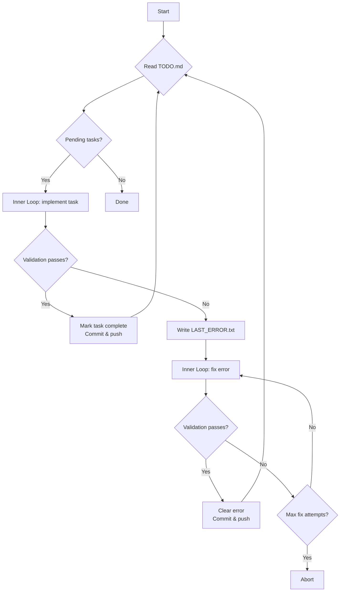

# ralphKlaw

ralphKlaw is an autonomous coding agent for Go projects, built for the [klaw.sh](https://klaw.sh) agent orchestration platform. It reads tasks from a `TODO.md` file, implements them using an inner agentic loop powered by Claude, validates the result, and commits the changes — iterating until all tasks are done.

Deploy and manage ralphKlaw alongside your other agents using `klaw`:

```bash
curl -fsSL https://klaw.sh/install.sh | sh
klaw apply -f .klaw/agents/ralphklaw.toml
klaw logs ralphklaw
```

## How it works



The outer **Ralph Loop** drives the process. The inner loop is a multi-turn Claude conversation with access to `bash`, `read`, `write`, `edit`, `glob`, and `grep` tools. After each task attempt, `go build ./... && go vet ./...` runs as the validation gate.

## Prerequisites

- Go 1.24+
- An Anthropic API key
- Git (optional, for auto-commit)

## Getting started

### 1. Clone and build

```bash
git clone <repo-url>
cd ralphKlaw
go build ./...
```

### 2. Initialize a workspace

Point ralphKlaw at any Go project directory:

```bash
./ralphklaw --init --workspace /path/to/your/project
```

This creates:
- `.klaw/agents/ralphklaw.yaml` — configuration file
- `.klaw/logs/` — log output directory
- `TODO.md` — task list template

### 3. Write your tasks

Edit `TODO.md` in your project:

```markdown
# TODO

- [ ] Add a health check endpoint to the HTTP server
- [ ] Write unit tests for the parser package
- [ ] Refactor the database connection pool
```

### 4. Run

```bash
export ANTHROPIC_API_KEY=sk-ant-...
./ralphklaw --workspace /path/to/your/project
```

ralphKlaw will work through each task, validate with `go build` and `go vet`, commit on success, and retry on failure.

## Configuration

The config file lives at `.klaw/agents/ralphklaw.yaml` in your workspace. Defaults:

```yaml
version: "1.0"
loop:
  max_iterations: 50
  max_fix_attempts: 3
inner_loop:
  max_rounds: 20
  model: claude-sonnet-4-20250514
  temperature: 0.0
  max_tokens: 8192
validation:
  command: "go build ./... && go vet ./..."
git:
  enabled: true
  auto_push: true
  commit_template: "ralphKlaw: iteration {iteration} [{mode}] {outcome}"
  remote_name: origin
logging:
  level: info
  file: .klaw/logs/ralphklaw.log
```

## CLI flags

| Flag | Default | Description |
|------|---------|-------------|
| `--workspace` | `.` | Path to the target Go project |
| `--init` | — | Initialize workspace and exit |

## Development

```bash
# Build
make build

# Test
make test

# Test with coverage
make test-cover
```

Logs are written to `.klaw/logs/ralphklaw.log` in the workspace.
